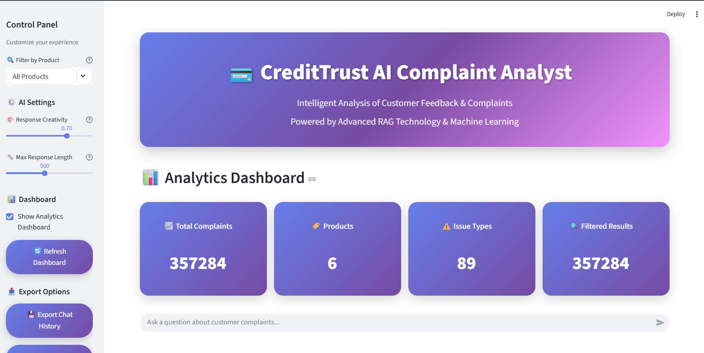

# CrediTrust Complaint RAG Chatbot

## Project Overview

This project develops an intelligent Retrieval-Augmented Generation (RAG) chatbot designed to answer user queries based on a knowledge base of customer complaint narratives. By combining efficient information retrieval with a language model, the chatbot aims to provide relevant and coherent responses to inquiries in the finance sector.

## Features

- **Data Preprocessing**: Cleans and prepares raw complaint data for analysis.
- **Text Chunking & Embedding**: Breaks down large narratives into smaller, semantically rich chunks and converts them into numerical embeddings.
- **FAISS Indexing**: Utilizes FAISS for fast and efficient similarity search of text embeddings.
- **RAG Pipeline**: Retrieves relevant information from the knowledge base and uses it to augment language model responses.
- **Interactive Dashboards**: Provides Streamlit-based interactive visualizations for demonstrating the chatbot's capabilities and exploring complaint data.
- **CI/CD**: Automated testing and deployment workflows using GitHub Actions.

## Project Structure

The repository is organized as follows:

```
.github/
  workflows/        # GitHub Actions CI/CD workflows
dashboards/         # Streamlit applications for interactive dashboards
docs/               # Project documentation and images
models/             # (Optional) Pre-trained models or checkpoints
notebooks/          # Jupyter notebooks for EDA, prototyping, and evaluation
src/                # Core Python source code
  data_preprocessing.py     # Scripts for cleaning and preparing data
  rag_pipeline.py           # Implementation of the RAG pipeline
  text_chunking_embedding.py # Handles text chunking and embedding generation
  utils.py                  # Utility functions
tests/              # Unit and integration tests
vectorstore/        # FAISS index and metadata storage
.gitignore          # Specifies intentionally untracked files to ignore
README.md           # Project README file
design-doc.md       # Detailed design document
requirements.txt    # Python dependencies
```

## Setup and Installation

To set up the project locally, follow these steps:

1.  **Clone the repository:**
    ```bash
    git clone https://github.com/your-username/CrediTrust-Complaint-RAG-Chatbot.git
    cd CrediTrust-Complaint-RAG-Chatbot
    ```

2.  **Create a virtual environment (recommended):**
    ```bash
    python -m venv env
    # On Windows
    .\env\Scripts\activate
    # On macOS/Linux
    source env/bin/activate
    ```

3.  **Install dependencies:**
    ```bash
    pip install -r requirements.txt
    ```

4.  **Download necessary data:**
    Ensure you have your `filtered_complaints.csv` file in the `data/` directory. This file is crucial for the `text_chunking_embedding.py` script.

5.  **Test the setup:**
    ```bash
    python test_setup.py
    ```

## Usage

### 1. Data Preparation and Indexing

First, you need to process the complaint data, generate embeddings, and create the FAISS index. This can be done by running the `text_chunking_embedding.py` script:

```bash
python src/text_chunking_embedding.py
```
This script will:
- Load data from `data/filtered_complaints.csv`.
- Chunk the narratives and generate embeddings.
- Save the chunks, embeddings, and metadata to the `vectorstore/` directory.

### 2. Running the Applications

#### Option A: Easy Startup (Recommended)
Use the startup script to choose your interface:

```bash
python run_app.py
```

#### Option B: Direct Commands
**Streamlit (Recommended - Better UI):**
```bash
streamlit run dashboards/streamlit_app.py
```

**Gradio (Alternative):**
```bash
python dashboards/app.py
```

Both applications will open in your web browser, allowing you to interact with the chatbot and visualize the data.

### 3. Running Tests

To run the project's tests, use `pytest` (ensure it's installed via `requirements.txt`):

```bash
pytest tests/
```

## CI/CD Pipeline

The project uses GitHub Actions for continuous integration and continuous deployment. The workflow defined in `.github/workflows/ci.yml` automatically builds and tests the application on every push to `main` and on pull requests targeting `main`.

## Troubleshooting

### Common Issues and Solutions

1. **Import Errors:**
   - Ensure all dependencies are installed: `pip install -r requirements.txt`
   - Check that you're using Python 3.8 or higher
   - Verify your virtual environment is activated

2. **Model File Not Found:**
   - The app will automatically use fallback models if the main GGUF model is missing
   - For best performance, download the Mistral model to the `models/` directory

3. **Data Loading Issues:**
   - Ensure `filtered_complaints.csv` exists in the `data/` directory
   - Check that the CSV has the required columns: 'Consumer complaint narrative', 'Product', 'Complaint ID'

4. **Performance Issues:**
   - The app uses CPU by default for compatibility
   - For better performance, ensure you have sufficient RAM (8GB+ recommended)

5. **Running the Setup Test:**
   ```bash
   python test_setup.py
   ```
   This will identify any configuration issues.

## Contributing

Contributions are welcome! Please refer to the `design-doc.md` for a deeper understanding of the project's architecture and components.

## License

This project is licensed under the MIT License. See the `LICENSE` file for details.
